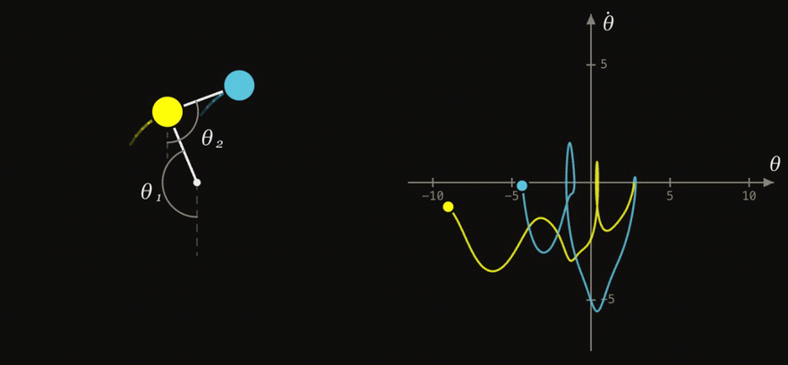

# Анимация маятника с помощью manim!

## Камбэк (2026)

Три года спустя проект вернулся — теперь как веб-версия, без установки и без рендера. Маятник качается прямо здесь: **<https://danyssg.github.io/pendulum/>** (или откройте [index.html](index.html) локально).

Три режима — автономный, с периодическим возмущением и двойной маятник (всё, что было в [double-pendulum](https://github.com/danySSG/double-pendulum), в одном файле). Физика считается в реальном времени (Рунге–Кутта 4-го порядка, шаг 2 мс): слайдеры меняют картинку мгновенно, а грузик можно хватать мышью и **бросать** — скорость руки передаётся маятнику.

Что ещё умеет:

- **Пресеты** — «Солнышко», «Сепаратриса», «Резонанс», «Хаос»: интересная физика в один клик;
- **Призраки** — 8 клонов двойного маятника с отличием в 10⁻⁶ рад разлетаются на глазах: та самая чувствительность к начальным условиям из theory.pdf;
- **Векторное поле и сепаратриса** на фазовом портрете (θ̇ = ±2√(g/l)·cos(θ/2));
- **Фазовый цилиндр** — плоскость / развёртка mod 2π / настоящий **3D-цилиндр** с наматывающейся траекторией, как и было обещано в [my-first-binder](https://github.com/danySSG/my-first-binder) ещё в 2023-м;
- **График энергии E(t)** — затухание, накачка резонансом, сохранение у двойного;
- **Запись видео** в один клик (та самая кнопка «Анимировать», только мгновенная) и **ссылки на состояние** — параметры живут в URL, можно делиться конфигурациями.

В 2023-м ролик на 30 секунд рендерился минутами. Теперь кадр считается за долю миллисекунды. Классическая manim-версия — ниже, без изменений.

## Установка

Пройдите по [ссылке](https://manim-course.notion.site/ManimCE-9f809a0d0ccc424e8f4b38fb74c24148) и выполните инструкции. Запаситесь терпением, manim требует много зависимостей для работы, установка всех их займёт время.

## Копирование проекта

Теперь вы можете [скопировать](https://github.com/danySSG/pendulum/archive/refs/heads/master.zip) этот репозиторий. После чего запустите скрипт `run.bat` для установки нужных python-библиотек.

## Всё готово!

Осталось запустить `window.py` и учиться.

## Замечание

Если анимация создаётся слишком долго, вы можете настроить параметры `config.frame_rate`, `config.pixel_height` и `config.pixel_width` в файле `animation.py`.
